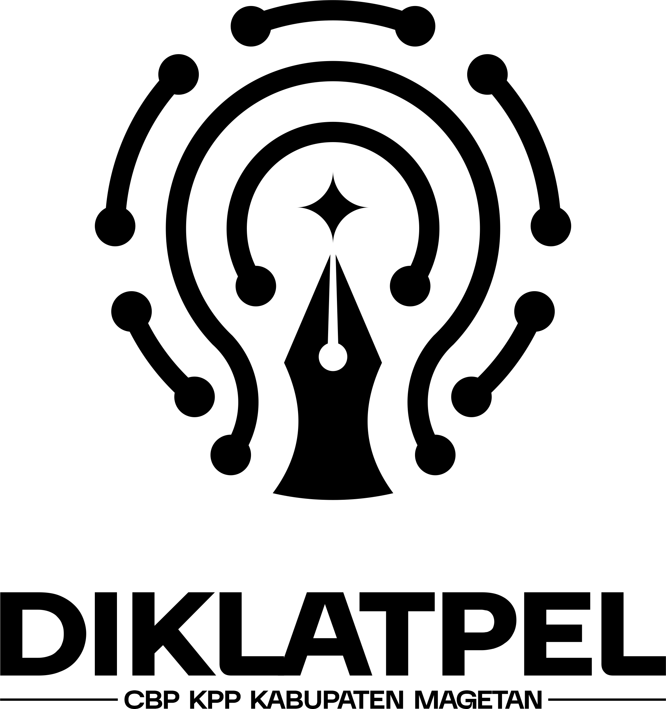

<div align="center">
  
</div>

<h1 align="center">Portal Pendaftaran DIKLATPEL 2026</h1>

<p align="center">
  Portal resmi Pendidikan dan Latihan Pelatih (DIKLATPEL)
  <br />
  DKC Corps Brigade Pembangunan IPNU & Korp Pelajar Putri IPPNU Kabupaten Magetan.
</p>

<div align="center">
  
  <a href="https://laravel.com"></a>
  <a href="https://react.dev"></a>
  <a href="https://www.typescriptlang.org/"></a>
  <a href="https://tailwindcss.com/"></a>
  <a href="https://www.postgresql.org/"></a>
  <a href="https://inertiajs.com/"></a>
</div>

---

## 📖 Tentang Sistem

Sistem ini adalah portal pendaftaran _Single Page Application_ (SPA) untuk memfasilitasi rekrutmen calon pelatih dalam Pendidikan dan Latihan Pelatih (DIKLATPEL) DKC CBP IPNU dan KPP IPPNU Kabupaten Magetan tahun 2026.

Sistem ini memastikan pengumpulan data peserta, unggahan berkas administratif, hingga proses _screening_ berjalan secara terpusat, modern, dan sangat cepat tanpa adanya _page reload_.

🔗 **URL Resmi:** [diklatpel.pelajarnumagetan.or.id](https://diklatpel.pelajarnumagetan.or.id)

URL deployment dikonfigurasi melalui nilai `APP_URL` pada environment produksi.

---

## ✨ Fitur Utama

- **Pendaftaran Tanpa Reload (SPA):** Formulir pendaftaran menggunakan arsitektur SPA yang memberikan pengalaman pengguna sangat halus dan responsif.
- **Validasi Keamanan Ekstra:** Dilengkapi dengan perlindungan anti-spam melalui **Cloudflare Turnstile** dan validasi _strict_ untuk mencegah injeksi karakter berbahaya.
- **Notifikasi Email Otomatis:** Sistem akan secara otomatis mengirimkan email konfirmasi resmi beserta tautan grup WhatsApp melalui sistem antrian (_queue_ di latar belakang).
- **Penyimpanan Berkas Terdistribusi:** Semua unggahan berkas (PDF, Foto) langsung diunggah dengan aman menuju **Cloudflare R2 Storage (S3 API)**.
- **Dashboard Admin Interaktif:**
    - Panel keputusan (Terima/Tolak) untuk tahap **Administrasi** dan **Screening**.
    - Manajemen pengaturan ketersediaan pendaftaran.
    - Fitur Hapus Data yang secara otomatis akan menghapus dan membersihkan _file_ fisik di _cloud storage_.
    - Navigasi mobile bergaya aplikasi dengan tombol Absensi utama, halaman Profil khusus, dan daftar data yang dioptimalkan untuk layar kecil.
- **Absensi QR Terintegrasi:**
    - QR unik dan aman dibuat otomatis untuk setiap peserta.
    - Hanya peserta yang lolos screening yang masuk ke daftar absensi.
    - Pemindaian dilindungi autentikasi, pembatasan laju permintaan, transaksi database, dan pencegahan pemindaian ganda.
    - Riwayat kehadiran tetap tersimpan meskipun status peserta kemudian berubah.
- **Ekspor Administrasi:** Data seleksi dapat diekspor ke Excel dan seluruh QR peserta lolos dapat diunduh sebagai satu berkas ZIP.

---

## 🚀 Rilis Saat Ini

Versi stabil terbaru adalah **v1.0.0 — Migrasi Laravel & Rebranding DIKLATPEL**.

Rilis ini menggantikan implementasi full-stack Next.js sebelumnya dengan Laravel 13, Inertia.js 3, React 19, dan TypeScript. Seluruh portal telah disesuaikan untuk DIKLATPEL 2026, termasuk pendaftaran peserta, seleksi administrasi dan screening, absensi QR, pengalaman admin responsif, PWA, serta identitas visual putih-oranye.

---

## 🧰 Teknologi

- PHP 8.3 dan Laravel 13
- React 19, TypeScript, Inertia.js 3, dan Tailwind CSS 4
- PostgreSQL untuk produksi dan SQLite untuk pengujian
- Cloudflare Turnstile dan Cloudflare R2
- shadcn/ui dan Radix UI

Ekstensi PHP `gd` dan `zip` diperlukan untuk menghasilkan gambar QR dan arsip ZIP.

---

## 💻 Menjalankan Proyek

```bash
composer install
npm ci
cp .env.example .env
php artisan key:generate
php artisan migrate:fresh --seed
composer dev
```

Isi konfigurasi database, Cloudflare R2, email, dan Turnstile pada `.env` sebelum menjalankan integrasi terkait. Nilai rahasia tidak boleh dimasukkan ke Git.

Untuk menjalankan seluruh pemeriksaan kualitas:

```bash
composer ci:check
npm run build
```

---

<div align="center">
<i>Dikembangkan untuk DKC CBP KPP PC IPNU IPPNU Kabupaten Magetan © 2026</i>
</div>
